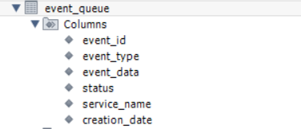
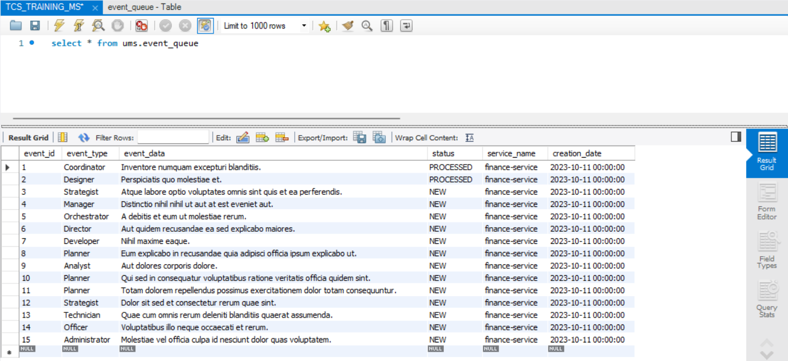
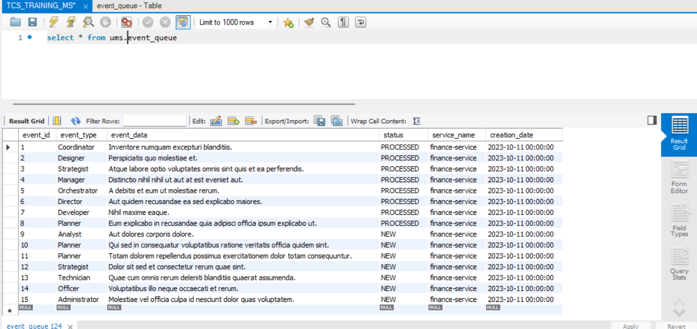

# University Management System - Event Driven Architecture

[](http://www.apache.org/licenses/LICENSE-2.0.html)

[Spring Boot](http://projects.spring.io/spring-boot/) based apps.

## Architecture Overview

### ```StudentService: ```
* Manages student registration for courses.
### ```LibraryService: ```
*  Manages course materials.
### ```FinanceService: ```
*  Manages tuition fees and scholarships.

In a university, upon a student registering for a course:

* They receive a welcome email.
* The library allocates course material or places an order if it’s unavailable.
* The finance department calculates the tuition fee and potentially offers scholarships based on criteria.

## Requirements

For building and running the application you need:

- [JDK 17](https://www.oracle.com/java/technologies/javase/jdk17-archive-downloads.html)
- [Maven 3](https://maven.apache.org)

## Running the application locally

There are several ways to run a Spring Boot application on your local machine. One way is to execute the `main` method
in the below classes from your IDE.

`com.tcs.training.finance.FinanceApplication`
[link](./finance-service/src/main/java/com/tcs/training/finance/FinanceApplication.java)

`com.tcs.training.student.StudentApplication`
[link](./student-service/src/main/java/com/tcs/training/student/StudentApplication.java)

Alternatively you can use
the [Spring Boot Maven plugin](https://docs.spring.io/spring-boot/docs/current/reference/html/build-tool-plugins-maven-plugin.html)
like so:

```shell
mvn spring-boot:run
```

### Prerequisite:
MySQL DB to be setup to run locally on port 3306 and should already have table ```event_queue``` on ```ums``` schema.
Columns: ```event_id```, ```event_type```, ```event_data```, ```status```, ```service_name```, ```creation_date```



## Local Application URLs

* localhost:8081 - Student
* localhost:8083 - Finance

### Swagger UI

http://localhost:{port}/swagger-ui/index.html
* Find ports above
* controllers added to route to swagger from base url


## API Test Scripts
Postman API test scripts can be found below.
[link](./postman-tests/EDA - Architecture Shared Queue.postman_collection.json)


### Database polling from Finance Service to process event queue.



## Note: LibraryService is not provided here and can be configured in similar way of FinanceService to process or consumed shared events.

## Copyright

Released under the Apache License 2.0. See
the [LICENSE](https://github.com/arghyagiri/microservice-e2/blob/main/LICENSE) file.
