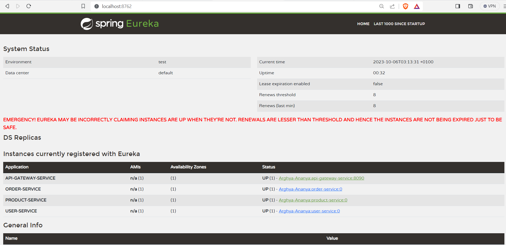
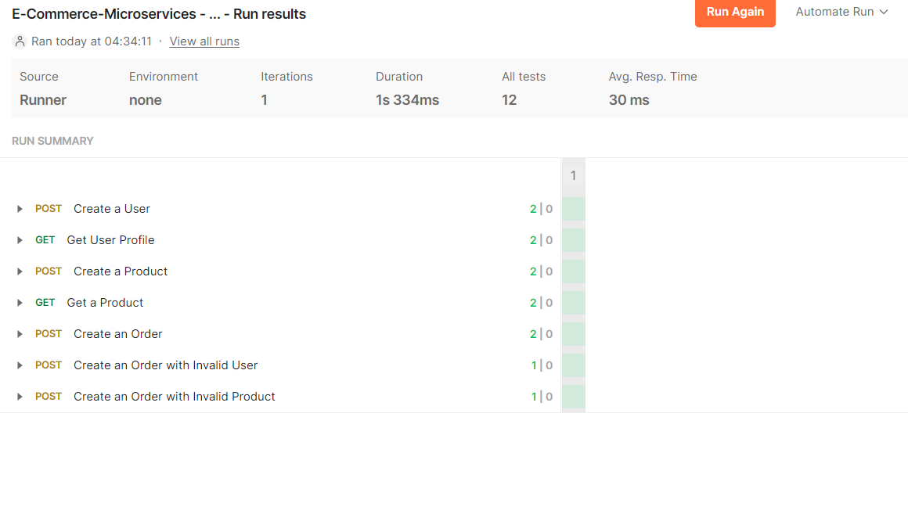

# E-Commerce Microservices - Declarative Programming - Spring OpenFeign

[](http://www.apache.org/licenses/LICENSE-2.0.html)

[Spring Boot](http://projects.spring.io/spring-boot/) based apps.

## Architecture Overview
### ```Discovery Service```
* Service registry
### ```API Gateway Service: ```
* Entry point for client requests. It routes the client requests to appropriate microservices.
### ```User Service: ```
* Manages user profiles
### ```Product Service: ```
* Handles CRUD operations for products.
### ```Order Service: ```
* Handles CRUD operations for orders. Depends on the ```Product Service``` to verify product availability.

## Requirements

For building and running the application you need:

- [JDK 17](https://www.oracle.com/java/technologies/javase/jdk17-archive-downloads.html)
- [Maven 3](https://maven.apache.org)

## Running the application locally

There are several ways to run a Spring Boot application on your local machine. One way is to execute the `main` method
in the below classes from your IDE.

`com.tcs.training.discovery.DiscoveryService`
[link](./discovery-service/src/main/java/com/tcs/training/discovery/DiscoveryService.java)

`com.tcs.training.apigateway.APIGatewayService`
[link](./api-gateway-service/src/main/java/com/tcs/training/apigateway/APIGatewayService.java)

`com.tcs.training.user.UserApplication`
[link](./user-service/src/main/java/com/tcs/training/user/UserApplication.java)

`com.tcs.training.product.ProductApplication`
[link](./product-service/src/main/java/com/tcs/training/product/ProductApplication.java)

`com.tcs.training.order.OrderApplication`
[link](./order-service/src/main/java/com/tcs/training/order/OrderApplication.java)

Alternatively you can use
the [Spring Boot Maven plugin](https://docs.spring.io/spring-boot/docs/current/reference/html/build-tool-plugins-maven-plugin.html)
like so:

```shell
mvn spring-boot:run
```

## Local Application URLs

### Base URL(API GATEWAY URL)

http://localhost:8090

### Service Discovery URL

http://localhost:8762



### Create a Customer
POST ```http://localhost:8090/users```
* Sample Request Body:
```json{
  "firstName": "Eriberto",
  "lastName": "Wiegand",
  "emailAddress": "Evan.Stehr@yahoo.com",
  "address": "737 Jenkins Village",
  "contactNumber": "321-317-5385"
}
```

* Sample Response Body:
```json{
  "userId": 3,
  "firstName": "Eriberto",
  "lastName": "Wiegand",
  "emailAddress": "Evan.Stehr@yahoo.com",
  "address": "737 Jenkins Village",
  "contactNumber": "321-317-5385"
}
```
### Create a Product
POST ```http://localhost:8090/products```
* Sample Request Body:
```json
{
  "productDescription": "Incredible Wooden Gloves",
  "seller": "Ball",
  "reviewRating": 2.5,
  "price": 440.80,
  "createDate": "2023-10-04",
  "quantity": 15
}
```

### Create an Order
POST ```http://localhost:8090/orders```
* Sample Request Body:
```json
{
"userId": 1,
"productIds": [
1,2,3,4
]
}
```

* Sample Response Body for 404 Error from User Service:
```json
{
  "title": "No Data Found",
  "status": 404,
  "detail": "[order-service] >> [user-service] >> No User found with id : 10000000",
  "instance": "/orders"
}
```

* Sample Response Body for 404 Error from Product Service:
```json
{
  "title": "No Data Found",
  "status": 404,
  "detail": "[order-service] >> [product-service] >> Requested products not available.",
  "instance": "/orders"
}
```

### Get User Profile
GET ```http://localhost:8090/users/{userId}```

* Sample Response Body:
```json{
  "userId": 3,
  "firstName": "Eriberto",
  "lastName": "Wiegand",
  "emailAddress": "Evan.Stehr@yahoo.com",
  "address": "737 Jenkins Village",
  "contactNumber": "321-317-5385"
}
```
### Swagger UI

http://localhost:{port}/swagger-ui/index.html
port is bound dynamically for all services other than gateway and discovery services.
* 8762 is the port for discovery service
* 8090 is the port for api gateway service
* port of other services can be found from discovery service home page.
http://localhost:8762


## API Test Scripts
Postman API test scripts can be found below.
[link](./postman-tests/E-Commerce-Microservices%20-%20Declarative%20Programming%20-%20Spring%20OpenFeign.postman_collection.json)


### Output from User service to get customer, order and product services


## Copyright

Released under the Apache License 2.0. See
the [LICENSE](https://github.com/arghyagiri/microservice-e2/blob/main/LICENSE) file.
