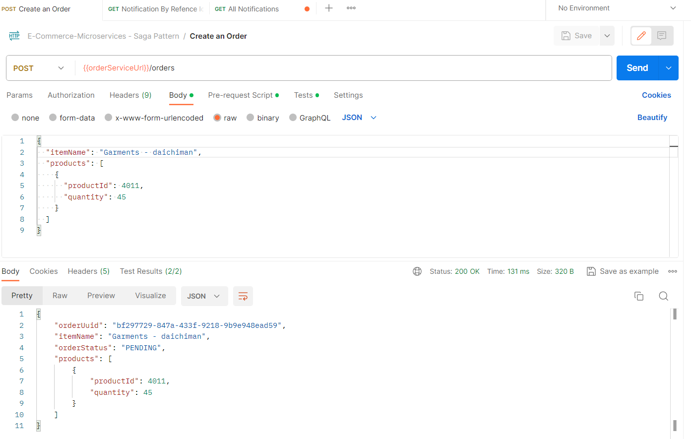
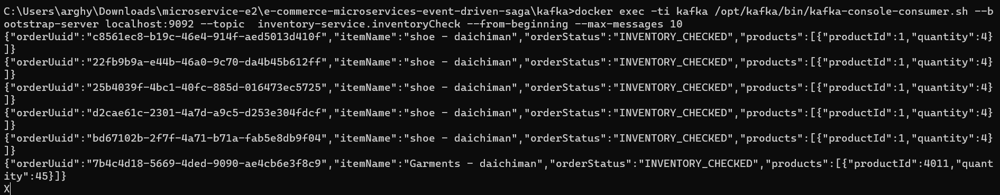
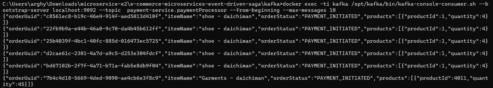
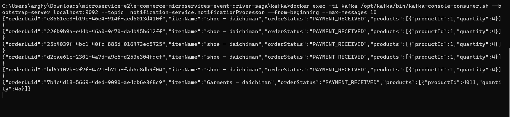

# SAGA Pattern - Event Driven Architecture

[](http://www.apache.org/licenses/LICENSE-2.0.html)

[Spring Boot](http://projects.spring.io/spring-boot/) based apps.

## Architecture Overview
### ```Inventory Service: ```
* Manages inventory
### ```Product Service: ```
* Handles CRUD operations for notifications.
### ```Order Service: ```
* Handles CRUD operations for orders. Depends on the ```Product Service``` to verify notification availability.
### ```Payment Service: ```
* Handles CRUD operations for payments.
### ```Notification Service: ```
* Handles CRUD operations for notifications.

* All service uses ```Kafka Message Broker``` to send update to other services to complete saga.

## Saga Flow:

* OrderService receives a request to place an order.
* It checks with InventoryService if the stock is available.
* If yes, InventoryService deducts the stock and emits a StockDeductedEvent.
* PaymentService listens to StockDeductedEvent, charges the payment, and emits a PaymentChargedEvent.
* NotificationService listens to PaymentChargedEvent and notifies the user.

## Requirements

For building and running the application you need:

- [JDK 17](https://www.oracle.com/java/technologies/javase/jdk17-archive-downloads.html)
- [Maven 3](https://maven.apache.org)

## Running the application locally

There are several ways to run a Spring Boot application on your local machine. One way is to execute the `main` method
in the below classes from your IDE.

`com.tcs.training.user.UserApplication`
[link](./inventory-service/src/main/java/com/tcs/training/inventory/InventoryApplication.java)

`com.tcs.training.notification.NotificationApplication`
[link](./notification-service/src/main/java/com/tcs/training/notification/ProductApplication.java)

`com.tcs.training.order.OrderApplication`
[link](./order-service/src/main/java/com/tcs/training/order/OrderApplication.java)

Alternatively you can use
the [Spring Boot Maven plugin](https://docs.spring.io/spring-boot/docs/current/reference/html/build-tool-plugins-maven-plugin.html)
like so:

```shell
mvn spring-boot:run
```

## Local Application URLs

localhost:8081 - Product
localhost:8082 - Inventory
localhost:8083 - Order

### Swagger UI

http://localhost:{port}/swagger-ui/index.html
* 8081 is the port for Product service
* 8082 is the port for Inventory service
* 8083 is the port for Order Service


## API Test Scripts
Postman API test scripts can be found below.
[link](./postman-tests/E-Commerce-Microservices - Saga Pattern.postman_collection.json)



Inventory Topic containing created order.


Payment topic containing created order.


Notification Topic containing created order.


## Copyright

Released under the Apache License 2.0. See
the [LICENSE](https://github.com/arghyagiri/microservice-e2/blob/main/LICENSE) file.
