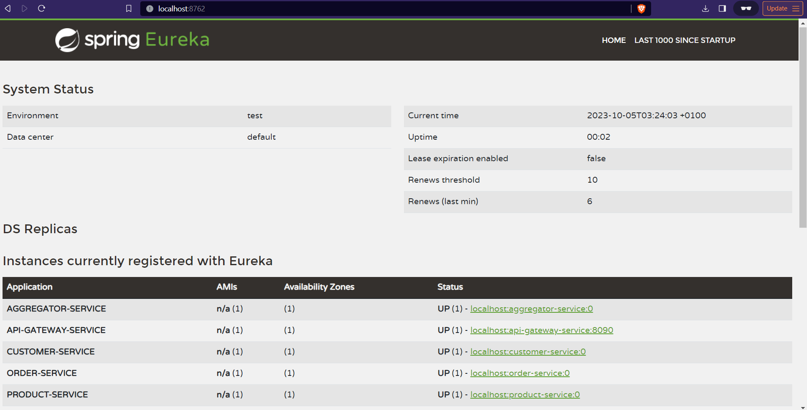
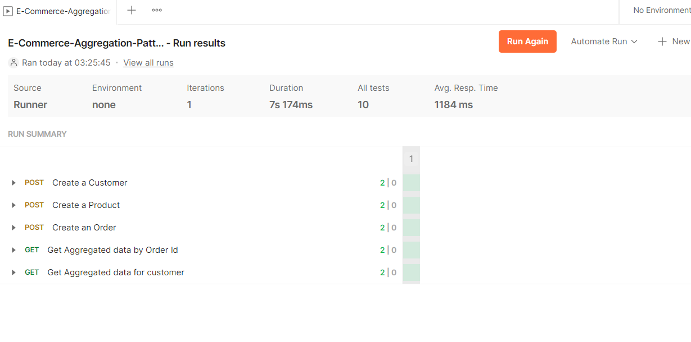

# E-Commerce Services Aggregator Pattern

[](http://www.apache.org/licenses/LICENSE-2.0.html)

[Spring Boot](http://projects.spring.io/spring-boot/) based apps.

## Architecture Overview
### Discovery Service
* Service registry
### API Gateway Service: 
* Entry point for client requests. It routes the client requests to appropriate microservices.
### Aggregator Service: 
* A service that talks to other microservices and combines the data.
### Customer Service: 
* Manages customer data.
### Product Service: 
* Manages product data.
### Order Service: 
* Manages order data.

## Requirements

For building and running the application you need:

- [JDK 17](https://www.oracle.com/java/technologies/javase/jdk17-archive-downloads.html)
- [Maven 3](https://maven.apache.org)

## Running the application locally

There are several ways to run a Spring Boot application on your local machine. One way is to execute the `main` method
in the below classes from your IDE.

`com.tcs.training.discovery.DiscoveryService`
[link](./discovery-service/src/main/java/com/tcs/training/discovery/DiscoveryService.java)

`com.tcs.training.apigateway.APIGatewayService`
[link](./api-gateway-service/src/main/java/com/tcs/training/apigateway/APIGatewayService.java)

`com.tcs.training.customer.CustomerApplication`
[link](./customer-service/src/main/java/com/tcs/training/customer/CustomerApplication.java)

`com.tcs.training.product.ProductApplication`
[link](./product-service/src/main/java/com/tcs/training/product/ProductApplication.java)

`com.tcs.training.order.OrderApplication`
[link](./order-service/src/main/java/com/tcs/training/order/OrderApplication.java)

`com.tcs.training.aggregator.AggregatorApplication`
[link](./aggregator-service/src/main/java/com/tcs/training/aggregator/AggregatorApplication.java)

Alternatively you can use
the [Spring Boot Maven plugin](https://docs.spring.io/spring-boot/docs/current/reference/html/build-tool-plugins-maven-plugin.html)
like so:

```shell
mvn spring-boot:run
```

## Local Application Urls

### Base Url(API GATEWAY URL)

http://localhost:8090

### Service Discovery URL

http://localhost:8762



### Swagger UI

http://localhost:<port>/swagger-ui/index.html
port is bound dynamically for all services other than gateway and discovery services.
* 8762 is the port for discovery service
* 8090 is the port for api gateway service
* port of other services can be found from discovery service home page.
http://localhost:8762


## API Test Scripts
Postman API test scripts can be found below.
[link](./postman-tests/E-Commerce-Aggregation-Pattern-Tests.postman_collection.json)




## Copyright

Released under the Apache License 2.0. See
the [LICENSE](https://github.com/arghyagiri/microservice-e2/blob/main/LICENSE) file.
