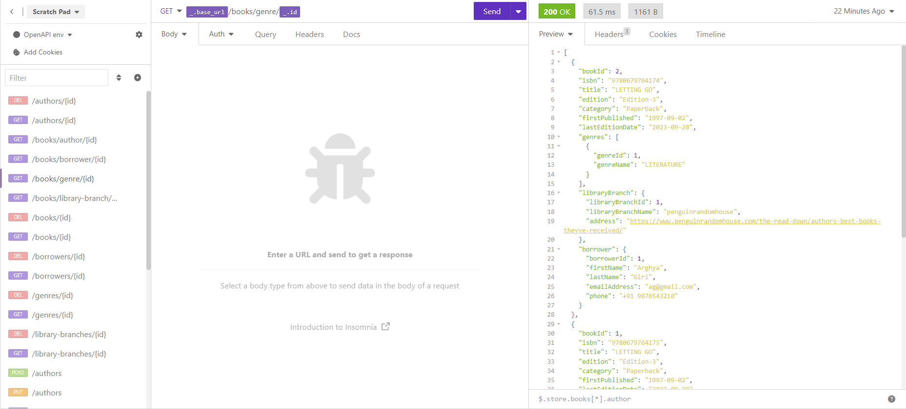

# Library-Management-App

[](http://www.apache.org/licenses/LICENSE-2.0.html)

 [Spring Boot](http://projects.spring.io/spring-boot/) based app.

## Requirements

For building and running the application you need:

- [JDK 17](https://www.oracle.com/java/technologies/javase/jdk17-archive-downloads.html)
- [Maven 3](https://maven.apache.org)

## Running the application locally

There are several ways to run a Spring Boot application on your local machine. One way is to execute the `main` method in the `com.tcs.training.ms.LibraryManagementApplication` class from your IDE.

Alternatively you can use the [Spring Boot Maven plugin](https://docs.spring.io/spring-boot/docs/current/reference/html/build-tool-plugins-maven-plugin.html) like so:

```shell
mvn spring-boot:run
```

## Application endpoints:

### Book Related Endpoints
* Retrieve all books: ```GET /api/books```
* Get a book by ID: ```GET /api/books/{id}```
* Add a new book: ```POST /api/books```
* Update a book: ```PUT /api/books/{id}```
* Delete a book: ```DELETE /api/books/{id}```
* 
### Author-related endpoints:
* Retrieve all authors: ```GET /api/authors```
* Get an author by ID: ```GET /api/authors/{id}```
* Add a new author: ```POST /api/authors```
* Update an author: ```PUT /api/authors/{id}```
* Delete an author: ```DELETE /api/authors/{id}```

### Genre-related endpoints:
* Retrieve all genres: ```GET /api/genres ```
* Get a genre by ID: ```GET /api/genres/{id}```
* Add a new genre: ```POST /api/genres```
* Update a genre: ```PUT /api/genres/{id}```
* Delete a genre: ```DELETE /api/genres/{id}```

### Library branch-related endpoints:
* Retrieve all library branches: ```GET /api/library-branches```
* Get a library branch by ID: ```GET /api/library-branches/{id}```
* Add a new library branch: ```POST /api/library-branches```
* Update a library branch: ```PUT /api/library-branches/{id}```
* Delete a library branch: ```DELETE /api/library-branches/{id}```

### Borrower-related endpoints:
* Retrieve all borrowers: ```GET /api/borrowers```
* Get a borrower by ID: ```GET /api/borrowers/{id}``` 
* Add a new borrower: ```POST /api/borrowers```
* Update a borrower: ```PUT /api/borrowers/{id}```
* Delete a borrower: ```DELETE /api/borrowers/{id}```

### Other endpoints:
* Retrieve books by genre: ```GET /api/books/genre/{id}```
* Retrieve books by author: ```GET /api/books/author/{id}```
* Retrieve books by library branch: ```GET /api/books/library-branch/{id}```
* Retrieve books borrowed by a borrower: ```GET /api/books/borrower/{id}```


## API Test Client



## Copyright

Released under the Apache License 2.0. See the [LICENSE](https://github.com/codecentric/springboot-sample-app/blob/master/LICENSE) file.
