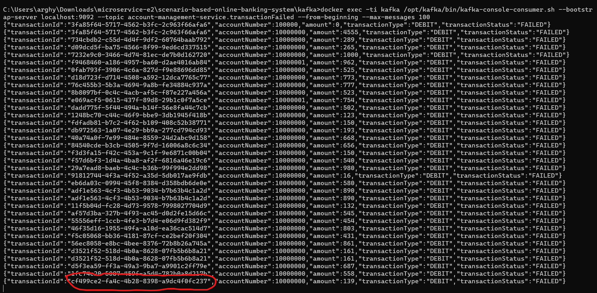

# Scenario Based Solution : Online Banking System

[](http://www.apache.org/licenses/LICENSE-2.0.html)

[Spring Boot](http://projects.spring.io/spring-boot/) based apps.

## Architecture Overview
### Account Management Service: 
* Manages user accounts, profile details, account balance, etc.
### Transaction Service: 
* Handles transactions between accounts, including logging and notifying relevant services of transaction events.
### Notification Service: 
* Sends notifications (SMS, Email) to customers regarding account activities.
### Audit Service: 
* Keeps track and logs every action and transaction within the system for auditing purposes.
### Fraud Detection Service: 
* Analyzes transaction patterns, and suspends accounts or blocks transactions that are likely to be fraudulent.

* All service uses ```Kafka Message Broker``` to send update to other services to complete saga.

## Storyline and Tasks:

## Task 1: Account Management and Transaction Services Interaction
* Scenario: John wants to transfer money to Emily but encounters a system error after his account is debited.
* Objective: Implement a Saga to manage transactions and ensure eventual consistency.
* Hints: Emit an event when the transaction is initiated and another when it's completed. If the transaction fails, the saga should initiate a compensating transaction to revert the debit from John's account.
## Task 2: Notification and Fraud Detection Services
* Scenario: A high-volume transaction is initiated from John’s account to an overseas account.
* Objective: Implement an event-driven communication system where the Fraud Detection Service analyses this unusual transaction, potentially blocking it and emitting an event that triggers the Notification Service.
* Hints: Use an event bus/channel. If a suspicious activity is detected, emit a SuspiciousActivityEvent which the Notification Service listens for.
## Task 3: Audit Service Tracking Transactions
* Scenario: Every transaction should be audited and logged, providing a trail for future references.
* Objective: Implement a Proxy Pattern in the Audit Service that logs transaction details without modifying the Transaction Service.
* Hints: Ensure to log relevant transaction details (amount, sender, recipient, timestamp) and possible failure reasons in a separate database.
## Task 4: API Gateway and External API Consumption
* Scenario: A third-party service provides forex rates, and our banking application should present the option to view current rates.
* Objective: Implement API Gateway to manage requests to both internal microservices and external APIs.
* Hints: The API gateway should route requests to the relevant microservice or external API without exposing the internal architecture to the client application.
## Task 5: Multi-Service Transaction and Compensation
* Scenario: John initiates a transaction which involves currency conversion and transfer.
* Objective: Develop a complex saga that manages a multi-service transaction, ensuring each step is successful or initiating compensating transactions.
* Hints: If the transaction fails at any point (e.g., forex API is down, insufficient funds after conversion rate applied), implement compensating transactions to revert any preceding transaction steps.
## Task 6: Implementing Security
* Scenario: Secure communication and data storage across microservices, considering sensitive customer data.
* Objective: Implement OAuth 2.0 for secure API access and data encryption standards for at-rest and in-transit data.
* Hints: Secure all inter-service communication and ensure data is encrypted when stored in databases.
## Task 7: Real-Time Notification System
* Scenario: Real-time account activity alerts for customers.
* Objective: Build a WebSocket communication system to notify users in real-time.
* Hints: The Notification Service should listen for events (e.g., successful transaction, login) and notify relevant users in real-time via WebSocket.
## Requirements

For building and running the application you need:

- [JDK 17](https://www.oracle.com/java/technologies/javase/jdk17-archive-downloads.html)
- [Maven 3](https://maven.apache.org)

## Running the application locally

There are several ways to run a Spring Boot application on your local machine. One way is to execute the `main` method
in the below classes from your IDE.

`com.tcs.training.user.InventoryApplication`
[link](./inventory-service/src/main/java/com/tcs/training/inventory/InventoryApplication.java)

`com.tcs.training.notification.NotificationApplication`
[link](./notification-service/src/main/java/com/tcs/training/notification/NotificationApplication.java)

`com.tcs.training.order.AccountApplication`
[link](./order-service/src/main/java/com/tcs/training/order/OrderApplication.java)

`com.tcs.training.payment.PaymentApplication`
[link](./payment-service/src/main/java/com/tcs/training/payment/PaymentApplication.java)


Alternatively you can use
the [Spring Boot Maven plugin](https://docs.spring.io/spring-boot/docs/current/reference/html/build-tool-plugins-maven-plugin.html)
like so:

```shell
mvn spring-boot:run
```

## Local Application URLs

localhost:8081 - Order
localhost:8082 - Inventory
localhost:8083 - Payment
localhost:8084 - Notification

### Swagger UI

http://localhost:{port}/swagger-ui/index.html
* use above-mentioned ports


## API Test Scripts
Postman API test scripts can be found below.
[link](./postman-tests/Scenario%20Bases%20-%20Online%20Banking%20System.postman_collection.json)


Inventory Topic containing created order.


Payment topic containing created order.


Notification Topic containing created order.



## Copyright

Released under the Apache License 2.0. See
the [LICENSE](https://github.com/arghyagiri/microservice-e2/blob/main/LICENSE) file.
